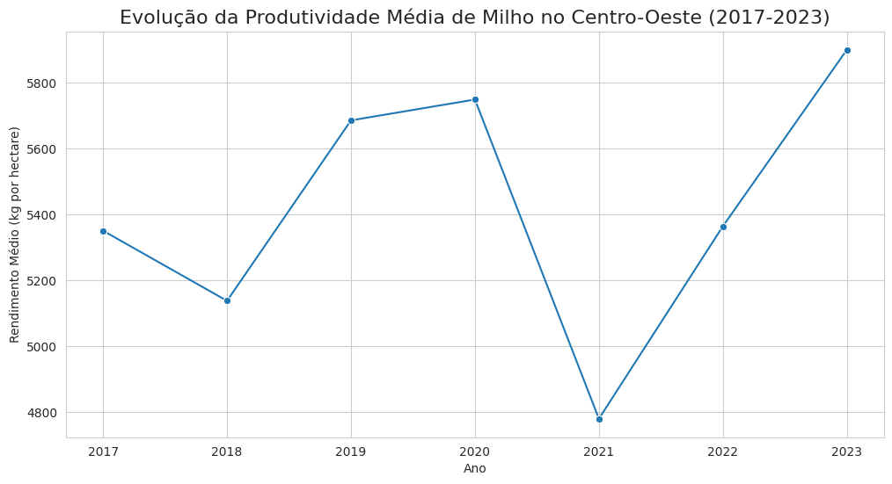
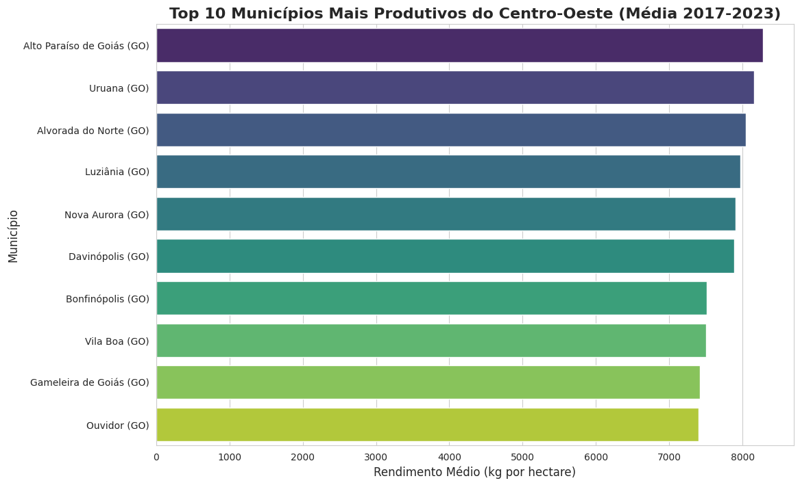
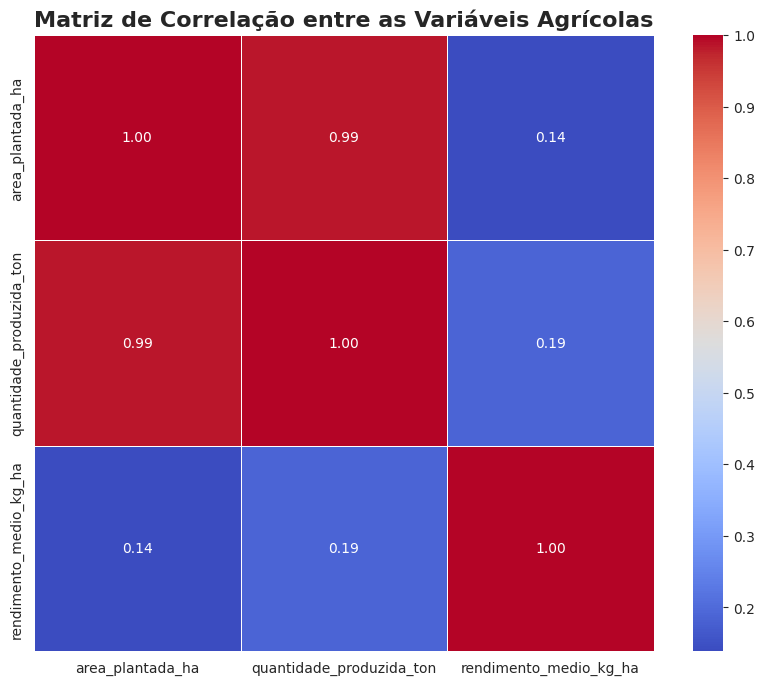

# 🌽 AgroVision: Previsão Inteligente de Safras


## 🎯 Objetivo do Projeto

Este projeto visa desenvolver um modelo de Machine Learning para prever a produtividade de safras de milho (em kg/ha) em municípios da região Centro-Oeste do Brasil. A solução utilizará dados históricos de produtividade, informações climáticas e, futuramente, índices de vegetação de imagens de satélite (NDVI) para fornecer previsões que auxiliem na tomada de decisão de produtores rurais.

## 📊 Fontes de Dados

* **Dados de Produtividade Agrícola:**
    * **Fonte:** SIDRA/IBGE (Tabela 5457).
    * **Variáveis:** Rendimento médio, área plantada, quantidade produzida.
    * **Período:** 2017-2023.
    * **Localização:** Municípios da Região Centro-Oeste.
* **Dados Geográficos:**
    * **Fonte:** Dataset público de Municípios Brasileiros (GitHub).
    * **Variáveis:** Latitude e Longitude por código de município.
* **Dados Climáticos:**
    * **Fonte:** API NASA POWER.
    * **Variáveis:** Precipitação média, Temperatura máxima e mínima.

## 🛠️ Tecnologias Utilizadas

* **Linguagem:** Python 3.x
* **Bibliotecas Principais:** Pandas, NumPy, Scikit-learn, Seaborn, Matplotlib, Requests, TQDM.
* **Ambiente:** Jupyter Notebooks no VS Code.
* **Versionamento:** Git & GitHub (Feature Branch Workflow).

## 🚀 Como Executar o Projeto

1.  **Clone o repositório:**
    ```bash
    git clone [URL_DO_SEU_REPOSITORIO_AQUI]
    cd AgroVision
    ```
2.  **Crie e ative o ambiente virtual:**
    ```bash
    python -m venv venv
    source venv/bin/activate
    ```
3.  **Instale as dependências:**
    ```bash
    pip install -r requirements.txt
    ```
4.  **Execute os Notebooks na ordem:**
    * `notebooks/01_ETL_IBGE.ipynb`: Para processar os dados brutos e gerar o dataset limpo.
    * `notebooks/02_Analise_Exploratoria.ipynb`: Para visualizar e analisar os dados processados.

## 📂 Estrutura do Repositório
├── data/
│   ├── raw/          # Dados brutos, como baixados da fonte.
│   └── processed/    # Datasets limpos e prontos para análise.
├── notebooks/
│   ├── 01_ETL_IBGE.ipynb
│   └── 02_Analise_Exploratoria.ipynb
├── .gitignore
├── README.md
└── requirements.txt

## 📈 Análises e Resultados Preliminares




---